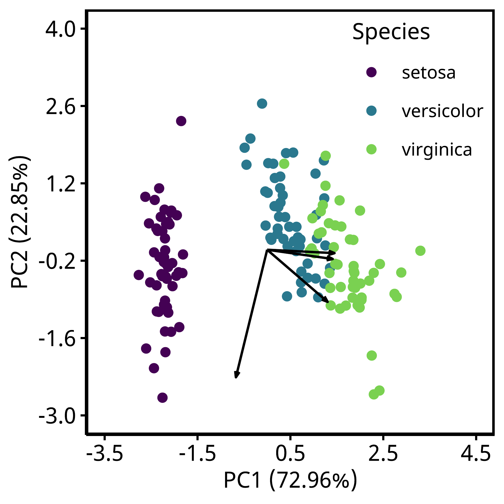

# Data analysis Workspace

解析を始める前に、パッケージの読み込みとフォントの設定を行います。
ここでの設定は、実際に研究室で使っている方法と同じです。
showtext パッケージはOSによってインストールがうまく行かない場合があるので、
その場合は、関数を自作します。

```
# パッケージの読み込み
library(tidyverse) # 作図用
library(stats) # 主成分分析用
library(vegan) # 非類似度の解析に使います
library(ggpubr) # 作図用
library(showtext) # フォント用
library(magick) # 図の保存用
```

読み込めなかったパッケージは適宜インストールしてください。

次に、フォントの設定を行います。
ここでは、Noto Sansを使います。
日本語で作図する際は Noto Sans JP がおすすめです。
font_add_google() で Google のフォントをSysfonts に追加します。
この関数を使う際は、インターネットに接続してください。
他のフォントは[Google Fonts](https://fonts.google.com/)
から確認することができます。
インターネットに接続することが難しい場合は、
システムのフォントから使えそうなものを選びます。
この場合、font_add() を使って編集することができます。
showtext_auto() を実行すると、これ以降に作られた図にこの設定が適用されます。

```
# フォントはGoogleのNoto Sans、フォントサイズは10ptに設定します
font_add_google(name = "Noto Sans", family = "ns")
theme_pubr(base_family = "ns", base_size = 10) |> 
  theme_set()
showtext_auto()
```

作図する場合は、図のサイズを引数に入れておくと便利です。
研究室では、地図の色なども同じように引数に入れて作成しています。
一般的に、論文を作成する際は 80mm×80mm で設定しています。

```
# 保存する図のサイズを指定します
# 80mm * 80mmにしておくと論文に掲載する際に便利です
height = 80
width = height
```

図を保存する際は一度pdfファイルに保存してからpngファイルに保存します。
この方法は直接pngファイルに保存するよりもきれいに保存できます。
また、pdfの方がエクスポートする際に安定することがあります。

## Principal Component Analysis (PCA)

主成分分析(PCA)は、多変量のデータセットから相関のある変数を主成分(PC)として計算する教師なし機械学習です。
ここでは、Rに標準搭載されているアヤメのデータセットを用いて主成分分析します。
読み込んだデータは、そのままだとそれぞれの変数の形式がわからないので、tibbleにします

```
df = iris |> as_tibble()
print(df)
```

読み込んだデータは、行列データに変換します。
この過程は[pca_workspace.R](https://github.com/Tomo-Aot/github_practice/blob/main/Data_analysis/pca_workspace.R)
を参照してください。
行列データに変換する際は、データを標準化します。
ここでは、scale()を使って標準化していますが、
生態学で標準化する際は少数のデータや0への重み付けが小さいHellinger変換を使うことが一般的です。
標準化する際は、それぞれのデータに適した距離を使います。

```
# 行列にする際に、データを標準化します
mat = scale(df[,c(1:4)], center = TRUE, scale = TRUE)
```

行列データをprcomp()に入れて主成分分析します。
veganパッケージのrda()でも主成分分析することができますが、ここでは使いません。

```
result = prcomp(mat)
print(result)
```

この結果から作図に使う要素を引数に入れていきます。
ggbiplotパッケージのggbiplotでデフォルトで矢印を付けてくれますが、
私はこの関数が好きではないので自作します。
個人的な話ですが、この関数の矢印は少し太すぎるので、図を保存する際に難儀しました。

種名を追加します。

```
pc = result$x |> 
  as_tibble() |> 
  mutate(Species = df$Species)
```

主成分を引数に入れる。
矢印の長さは結果のrotationです。

```
rot = result$rotation
```

次に、各主成分の寄与率を計算します。
主成分の寄与率は計算する必要があるので、関数を作ります。

```
ctb = function(x){
  sdev = x
  variance = sdev ^ 2
  total_variance = sum(variance)
  contribution = variance / total_variance * 100
  return(contribution)
}
```

作図の結果は下の図のようになります。


